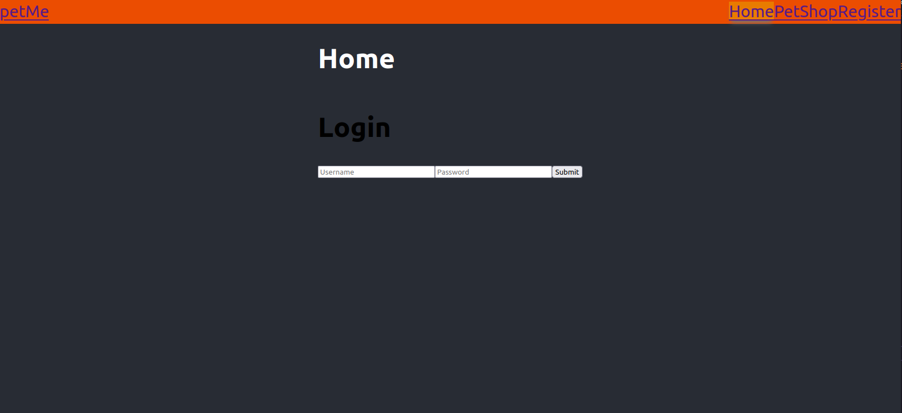
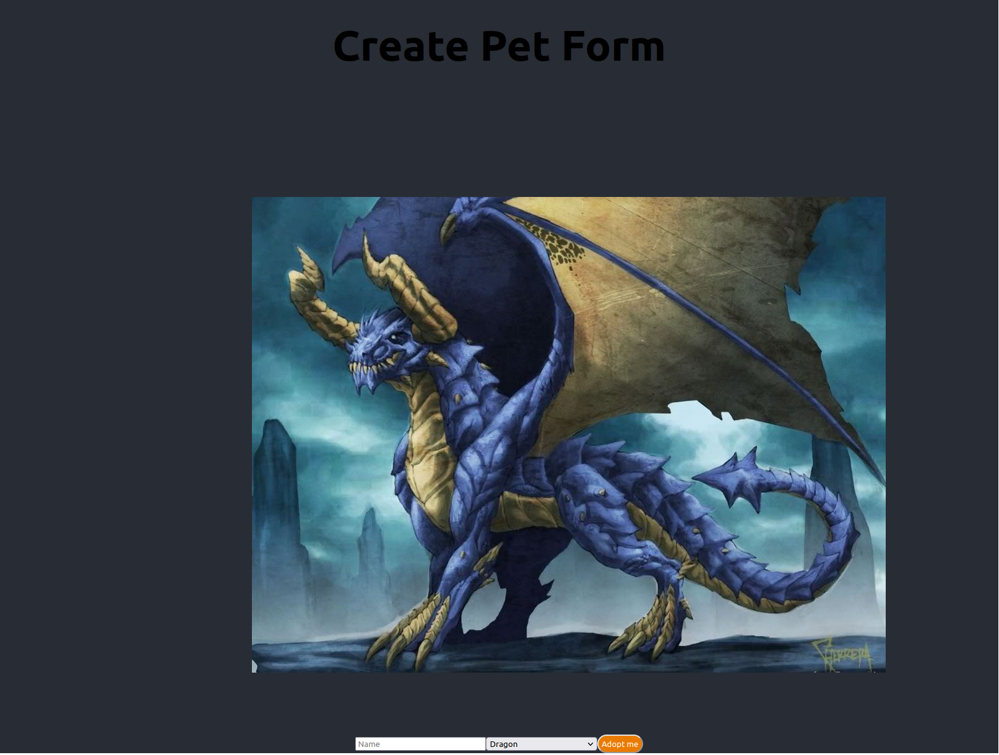
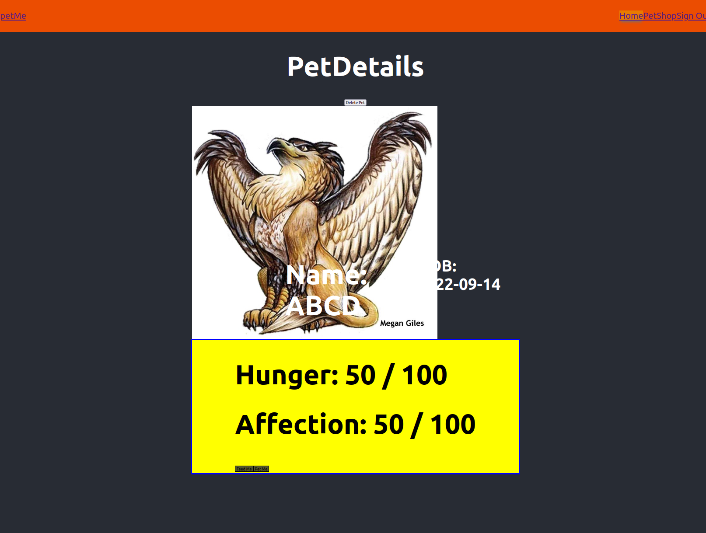

# petMe

## Date: 9/1/2022

### By: Steve Kim [GitHub](https://github.com/Skim1571) | [LinkedIn](https://www.linkedin.com/in/skim1571/)

---

### **_Description_**

#### This app allows you to register, choose a pet, and interact with it.

#### The user will be able to do the following: 

- Create an account
- Choose your pet 
- Name your pet.
- Interact with your pet  

---

### **_Technologies Used_**

- React
- CSS
- HTML
- Javascript
- Python
- Django
- Tailwind
---

### **_Getting Started_**

#### You will start on the landing page and can register or login. Once you login, you will be able to either interact with your existing pet or choose and name a new pet. Then you can interact with your digital friend.

---
### **_Project Management_**

### [ERD](https://drive.google.com/file/d/1VIFOTEsFUha3lEeOdRlnfHmZtbcW05kx/view?usp=sharing)

### [CHD](https://drive.google.com/file/d/1FYWQ0_bRk0CIqAIGUp0fZjA3RmStugF4/view?usp=sharing)

### [Trello](https://trello.com/b/IPlI46ft/petme)

---

### **_Screenshots_**

#### Image1

### **_Future Updates_**

- [] CSS Styling update
- [ ] Animation when interacting with Pet
- [ ] Mobile device settings
- [ ] Options for what types of interactions you can do

---

### **_Credits_**

#### : dependency to post with nested models

#### : dependency to use JWT with Django

---
© 2022 GitHub, Inc.